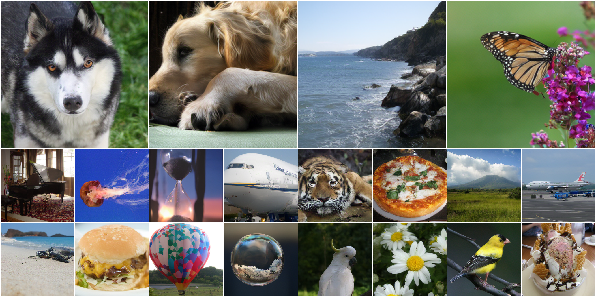

# DINO-SAE: DINO Spherical Autoencoder for High-Fidelity Image Reconstruction and Generation



> **Figure 1.** Generated images from DiTDH model trained on DINO-SAE latents. DINO-SAE achieves state-of-the-art reconstruction quality while maintaining strong semantic alignment to the pretrained VFM.

[]()

This repository is the official implementation of the paper: **"DINO-SAE: DINO Spherical Autoencoder for High-Fidelity Image Reconstruction and Generation"** (Under Review at ICML).

## 📖 Abstract

Recent studies have explored using pretrained Vision Foundation Models (VFMs) such as DINO for generative autoencoders. Unfortunately, existing approaches often suffer from limited reconstruction fidelity due to the loss of high-frequency details.

**DINO-SAE** bridges semantic representation and pixel-level reconstruction through three key contributions:

1.  **Hierarchical Convolutional Patch Embedding**: Enhances local structure and texture preservation, mitigating the information bottleneck of standard ViT patchification.
2.  **Cosine Similarity Alignment**: Enforces semantic consistency (direction) while allowing flexible feature magnitudes for detail retention, resolving the conflict between semantic preservation and reconstruction.
3.  **Riemannian Flow Matching (RFM)**: Trains a Diffusion Transformer (DiT) directly on the spherical latent manifold, leveraging the intrinsic geometry of SSL-based representations.

Experiments on ImageNet-1K demonstrate that our approach achieves **0.37 rFID** and **26.2 dB PSNR**, setting a new state-of-the-art for VFM-based autoencoders.

## 🚀 Key Features

- **High-Fidelity Reconstruction**: Outperforms RAE and VAVAE in pixel-level reconstruction quality.
- **Efficient Convergence**: Riemannian Flow Matching accelerates training, achieving a gFID of 3.47 at just 80 epochs (6.67x faster than SD-VAE baselines).
- **Scale-Decoupled Training**: Uses Cosine Similarity Loss to decouple semantic alignment from feature magnitude.

## 🛠️ Installation

```bash
conda create -n dinosae python=3.9
conda activate dinosae
pip install -r requirements.txt
```

## 🏗️ Architecture & Method

DINO-SAE modifies the standard ViT encoder to bridge the gap between semantic representation and high-fidelity reconstruction.

1.  **Hierarchical Convolutional Stem**: We replace the standard linear patch embedding with a 4-stage CNN. This preserves high-frequency details (edges, textures) that are typically lost during aggressive patchification.
2.  **Cosine Similarity Alignment**: Instead of MSE, we align features using Cosine Similarity. This decouples semantic alignment (direction) from signal strength (magnitude), resolving the optimization conflict between the frozen teacher (DINOv3) and the reconstruction objective.
3.  **Spherical Latent Manifold**: We utilize **Riemannian Flow Matching (RFM)** on a hyperspherical latent space, leveraging the observation that SSL features naturally lie on a hypersphere.

## 💻 Usage

### Data Preparation

### Training (Autoencoder)

We employ a **4-Stage Progressive Training Strategy** to balance semantic alignment and reconstruction quality.

**Stage 1: Semantic-Structural Alignment**
Trains the Convolutional Patch Embedding and Decoder from scratch.

<!-- ```bash
python train_ae.py \
    --stage 1 \
    --data_path /path/to/imagenet \
    --batch_size 256 \
    --lr 1e-5 \
    --lambda_cos 0.5 \
    --lambda_lpips 1.0
``` -->

**Stage 2: Adversarial Adaptation** Adds GAN loss with a DINO-based Discriminator to enhance textural realism.

<!-- ```bash
python train_ae.py \
    --stage 2 \
    --resume output/stage1/checkpoint.pth \
    --lr 1e-4 \
    --lambda_adv 0.5
``` -->

**Stage 3: Decoder Refinement** Freezes the entire encoder (including the patch embedding) to fix the semantic latent space, fine-tuning only the decoder.

<!-- ```bash
python train_ae.py \
    --stage 3 \
    --resume output/stage2/checkpoint.pth \
    --freeze_encoder \
    --lr 1e-4
``` -->

**Stage 4: Noise Augmentation** Injects noise into the latents while keeping the encoder frozen to make the decoder robust for generative modeling.

<!-- ```bash
python train_ae.py \
    --stage 4 \
    --resume output/stage3/checkpoint.pth \
    --noise_aug True \
    --lr 5.4e-5
``` -->

**Generation (Riemannian Flow Matching)**
Train the Diffusion Transformer (DiT) on the spherical latent space extracted by DINO-SAE.

<!--
```bash
python train_dit.py \
    --ae_checkpoint output/stage4/checkpoint.pth \
    --model DiT-XL/2 \
    --rfm True \
    --epochs 80
``` -->

## 📊 Results

### Reconstruction Quality (ImageNet 256x256)

DINO-SAE significantly outperforms existing VFM-based autoencoders in terms of pixel-level fidelity.

| Model               |  rFID ↓  |  PSNR ↑   |
| :------------------ | :------: | :-------: |
| SD-VAE              |   0.62   |   26.04   |
| VAVAE               |   0.28   |   27.96   |
| RAE                 |   0.59   |   18.94   |
| **DINO-SAE (Ours)** | **0.37** | **26.20** |

### Generation Quality

Using DINO-SAE latents leads to faster convergence and higher generation quality compared to RAE and VAVAE baselines.

| Method                         | Epochs |  gFID ↓  |   IS ↑    |
| :----------------------------- | :----: | :------: | :-------: |
| RAE + LightningDiT-XL          |   80   |   4.28   |   214.8   |
| **DINO-SAE + LightningDiT-XL** |   80   | **3.47** | **202.1** |
| **DINO-SAE + DiTDH-XL**        |   80   | **3.07** | **209.7** |

## 📜 Citation

If you find this work useful for your research, please cite our paper:

```bibtex
@article{dino_sae_2025,
  title={DINO-SAE: DINO Spherical Autoencoder for High-Fidelity Image Reconstruction and Generation},
  author={Anonymous Authors},
  journal={Under Review at ICML},
  year={2025}
}
```

## 🙏 Acknowledgement

This project is built upon the following open-source projects. We thank the authors for making their code and models available.

<!--
- [cite_start]**[DINOv3](https://github.com/facebookresearch/dinov2)**: We utilize the pre-trained DINOv3 ViT-Large as our frozen encoder backbone[cite: 265, 328].
- [cite_start]**[RAE](https://github.com/imzhengboy/RAE)**: Our noise augmentation strategy and baseline comparisons are adopted from the RAE codebase[cite: 447].
- [cite_start]**[DC-AE](https://arxiv.org/abs/2410.10733)**: We adopt the lightweight decoder architecture proposed in DC-AE for efficient upsampling[cite: 329].
- [cite_start]**[SiT](https://github.com/willmcneil/SiT)** & **[DiT](https://github.com/facebookresearch/DiT)**: The diffusion transformer architectures for our generative experiments are based on these repositories[cite: 128, 579]. -->
